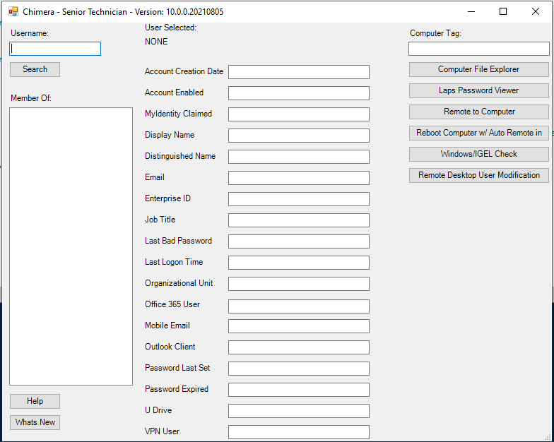

# Chimera

A useful interface for working with typical help desk functionality of Active Directory Built 100% in Powershell

## Features

- Active Directory Attributes for User Searched (Account Creation Date, Account Status, Last Logon Date, Password Last Set Date, etc)
- Auto Launch Remote Computer File Explorer if C$ is an Enabled Feature in the Enterprise
- Local Administrator Password of Remote PC if LAPS is used in the Enterprise
- Remote to Computer with the use of SCCM's Remote Control Viewer
- Reboot Remote Computer and Automatically Remote in Once Host is Back Online (SCCM Remote Control Viewer)
- Remote Desktop User Management

## Installation

Install RSAT From Microsoft

Look Through Script, there will be Numerous '**REDACTED**' lines. Replace these Lines with Information Specific for Your Enteprise
- Line 103: Replace **REDACTED** with the Deploy Location of the script. This will Check for Updates if a User Launches this from their Local Machine. 
- Line 115: Same as Above
- Line 147: Replace this with an Icon Path
- Line 162: This was Originally Access Control. Replace this with a Shared Text File Containing SamAccountName's that you wish to be able to run this file. Remove if you do not wish to have access control
- Line 163: Same as Above
- Line 241: Replace with Active Directory Membership for VPN Access
- Line 646: Replace with Shared Text Document Detailing Functions, Help, etc
- Line 660: Same as Above Icon Path
## Run Locally

Right Click on ps1 Script and Click 'Run with Powershell'

## Authors

- [@jbrotosky](https://www.github.com/jbrotosky)

